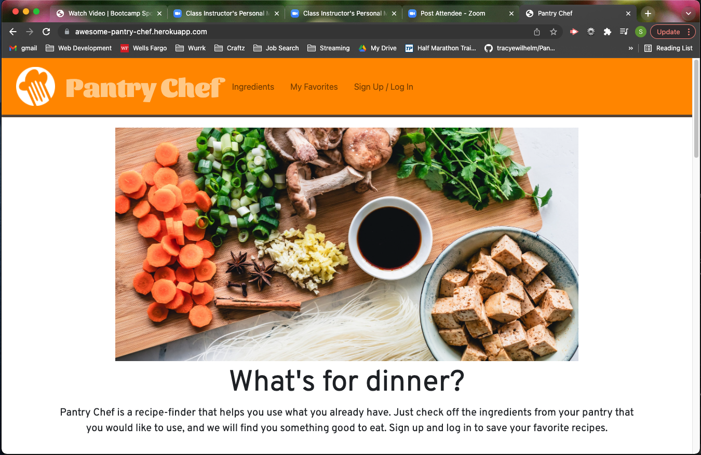
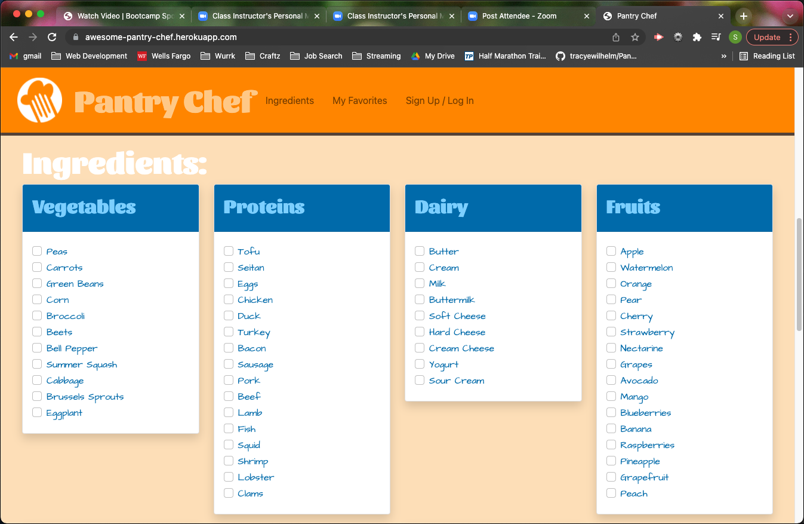
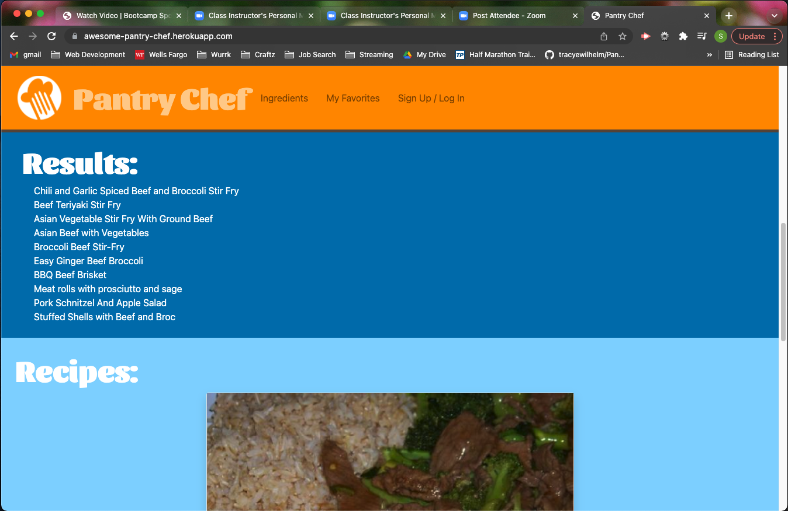
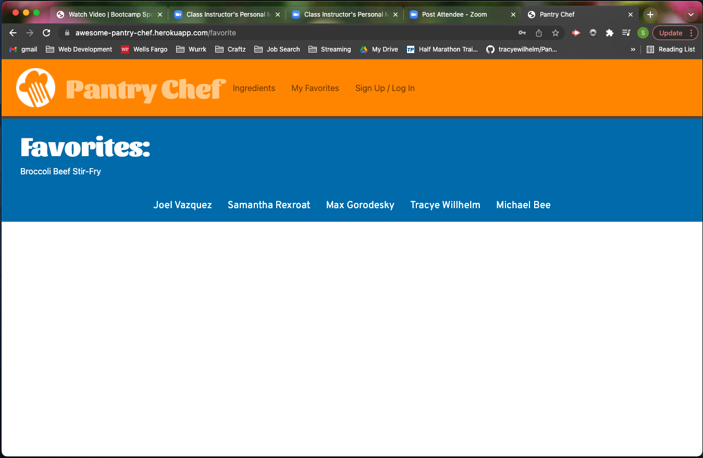

# Pantry Chef

## Description
A full-stack recipe application that allows a user to enter their selected pantry ingredients and returns a list
of recipes that include those ingredients. Users can view these recipes and store them to a list by creating an account.

## Table of Contents
* [Technologies Used](#technologies)
* [Screenshots](#screenshots)
* [Links](#links)
* [Contributors](#contributors)

## Technologies Used
* HTML
* CSS
* Bootstrap
* Handlebars.js
* JavaScript
* JSON
* MySQL
* bcrypt
* Express.js
* Sequelize.js
* Spoonacular API

## Screenshots

## Links
[Deployed Live](https://awesome-pantry-chef.herokuapp.com)  

[GitHub Repository](https://github.com/tracyewilhelm/Pantry_Chef.git)

## Contributors
[Tracye Willhelm](https://github.com/tracyewilhelm) 
[Michael Bee](https://github.com/Michael-Bee) 
[Samantha Rexroat](https://github.com/samanthajrexroat) 
[Max Gorodesky](https://github.com/jmg5369) 
[Joel Vazquez](https://github.com/Lumin-El)